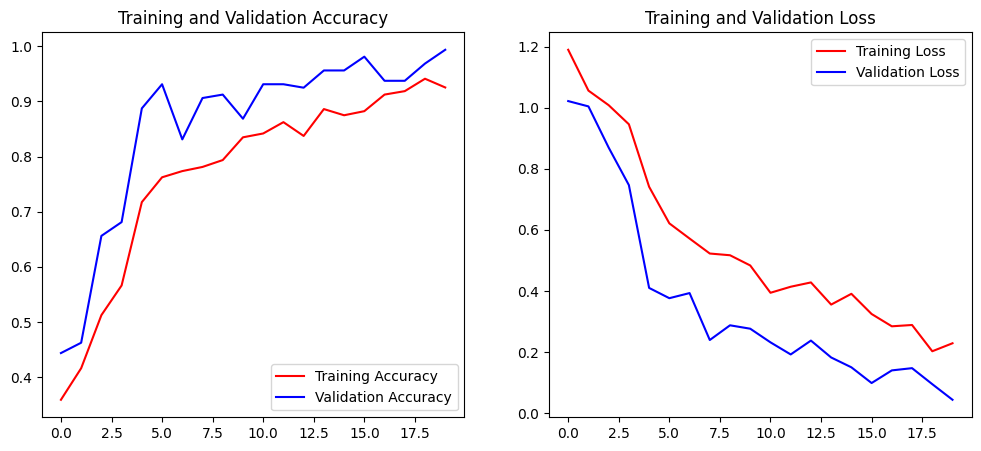

# 🖐️✌️✊ Real-Time Hand Gesture Classifier (CNN)


## 📄 Project Overview

Proyek ini adalah implementasi **end-to-end Computer Vision**, mulai dari melatih model **Convolutional Neural Network (CNN)** hingga mendeploy-nya sebagai **aplikasi klasifikasi real-time**. Model ini mampu mengenali dan membedakan gestur tangan (Batu, Gunting, Kertas) secara langsung melalui webcam.

Proyek ini mencakup:
1.  **Pelatihan Model:** Membangun arsitektur CNN dari nol menggunakan TensorFlow/Keras.
2.  **Augmentasi Data:** Meningkatkan ketangguhan model dengan teknik augmentasi gambar.
3.  **Aplikasi Real-Time:** Menggunakan OpenCV untuk menghubungkan model yang sudah terlatih dengan feed webcam untuk klasifikasi secara langsung.

---

## 🎯 Problem & Goal

Tujuan utama dari proyek ini adalah membangun sebuah sistem yang dapat:
1.  Mengenali dan membedakan pola visual dari tiga gestur tangan yang berbeda.
2.  Mencapai akurasi validasi **di atas 98%** pada data yang belum pernah dilihat sebelumnya.
3.  Menjadi dasar untuk proyek-proyek Computer Vision interaktif lainnya.

---

## 📂 Project Structure

Proyek ini disusun dengan struktur yang bersih dan modular untuk memisahkan antara eksperimen dan aset final:
```
Project-RPS-Classifier-CNN/
├── assets/
│   └── training_plot.png       # Screenshot hasil plot training
│
├── models/
│   └── rps_cnn_model.h5        # Model final yang sudah terlatih
│
├── notebooks/
│   └── CNN_RPS_Classifier.ipynb  # Notebook untuk eksperimen & training
│
├── realtime_classifier.py        # Skrip untuk menjalankan aplikasi webcam
├── .gitignore
├── README.md
└── requirements.txt
```
---

## 🛠️ Tech Stack

* **TensorFlow & Keras:** Untuk membangun dan melatih arsitektur CNN.
* **OpenCV (`opencv-python`):** Untuk menangkap dan memproses video dari webcam.
* **NumPy:** Untuk manipulasi data numerik dan array.
* **Matplotlib:** Untuk visualisasi hasil training di notebook.
* **Google Colab & VS Code:** Digunakan untuk training (Colab/GPU) dan development aplikasi (VS Code).

---

## 📈 Results

Model CNN yang dibangun berhasil mencapai **akurasi validasi puncak yang luar biasa sebesar 99.37%**. Analisis kurva *loss* dan *accuracy* menunjukkan bahwa teknik **Data Augmentation** yang diterapkan sangat efektif dalam mencegah *overfitting* dan meningkatkan kemampuan generalisasi model.



Model yang sudah dilatih disimpan di dalam folder `/models` dengan nama `rps_cnn_model.h5`.

---

## 🚀 How to Run

### 1. Training The Model (Optional, on Google Colab)
Notebook untuk melatih model dari awal (`CNN_RPS_Classifier.ipynb`) tersedia di folder `/notebooks`. Anda bisa mengunggah dan menjalankannya di Google Colab dengan akselerator GPU.

### 2. Running The Real-Time Application (Lokal)

Aplikasi ini akan menggunakan model yang sudah kami latih (`rps_cnn_model.h5`).

**A. Clone the repository:**
```bash
git clone [https://github.com/rizanss/RPS-Classifier-CNN.git](https://github.com/rizanss/RPS-Classifier-CNN.git)
cd RPS-Classifier-CNN
```

**B. Create and activate a virtual environment:**
```bash
# Buat environment
python -m venv .venv

# Aktivasi (Windows)
.\.venv\Scripts\activate

# Aktivasi (macOS/Linux)
source .venv/bin/activate
```

**C. Install dependencies:**
```bash
python -m pip install -r requirements.txt
```

**D. Run the classifier!**
```bash
python realtime_classifier.py
```
Arahkan tangan Anda ke webcam dan tekan **'q'** untuk keluar.

---

## 📬 Contact
* **Author:** Riza Nursyah
* **GitHub:** [rizanss](https://github.com/rizanss)
* **LinkedIn:** [Riza Nursyah](https://www.linkedin.com/in/riza-nursyah-31a6a7221/)